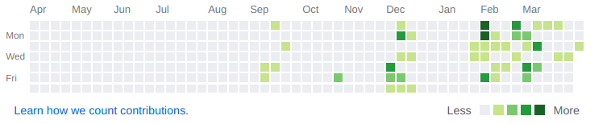

# 心烦

&emsp;&emsp;2019-4-9

&emsp;&emsp;最近事情太多了。首先我要去赔偿一下丢失的一本书，其次我居然还要写检查???这有意思吗？都多大的人了，学校真的是越来越脑残了。接着还有心累的事情，帮别人写代码是第一次遇到需求这么麻烦的客人，要满分，我这里的性能测试已经是满分了，然而她学校的server端竟然还是只能跑80分左右，我真的不明白为什么。还有一些琐碎的事情就不说了。

&emsp;&emsp;我现在都还没开始复习，不过，复习是肯定要复习的，考研还是要考的。在闲鱼做做小生意是没有多少钱的，而且很麻烦，不如去当大公司的螺丝钉。上级指示怎么写就这么写，而不是闲鱼上面形形色色的闲杂人员。一会儿让你这么写，一会儿又要那么写，也不知道他们累不累。

&emsp;&emsp;让我想想，我现在好久没有因为自己的想法而写代码了，单纯是觉得能赚一点钱而写的代码，我觉得这样很不好，似乎违背了自己的初心。有的时候我在想，我每天都盯着屏幕，重复着ctrl+c ctrl+v到底有什么意思，去github上面clone一下，make一下，跑的可以就交货。我有学到什么了吗？设计模式都懂吗，语法真的清楚吗，上次下一个llvm都要百度半天，我真的喜欢编程吗？还是已经把它当成了谋生的手段？

&emsp;&emsp;接下来该怎么办，我不大知道接下去的路该怎么走了。要是我能多扪心自问，问问自己的良心就好了，有没有一点点的惭愧？如果我真的是立志成为一名程序员而不是码农的话，是不是应该要改改自己的做法了呢?

&emsp;&emsp;好好看一眼你github的提交量，这个也配叫程序员吗？好好反省一下吧!

- [x]  ok
- []  no